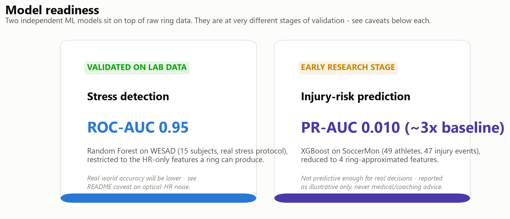
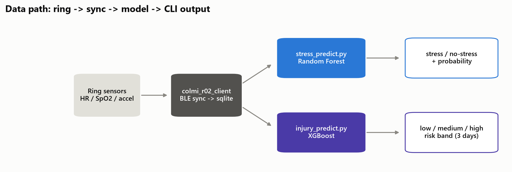
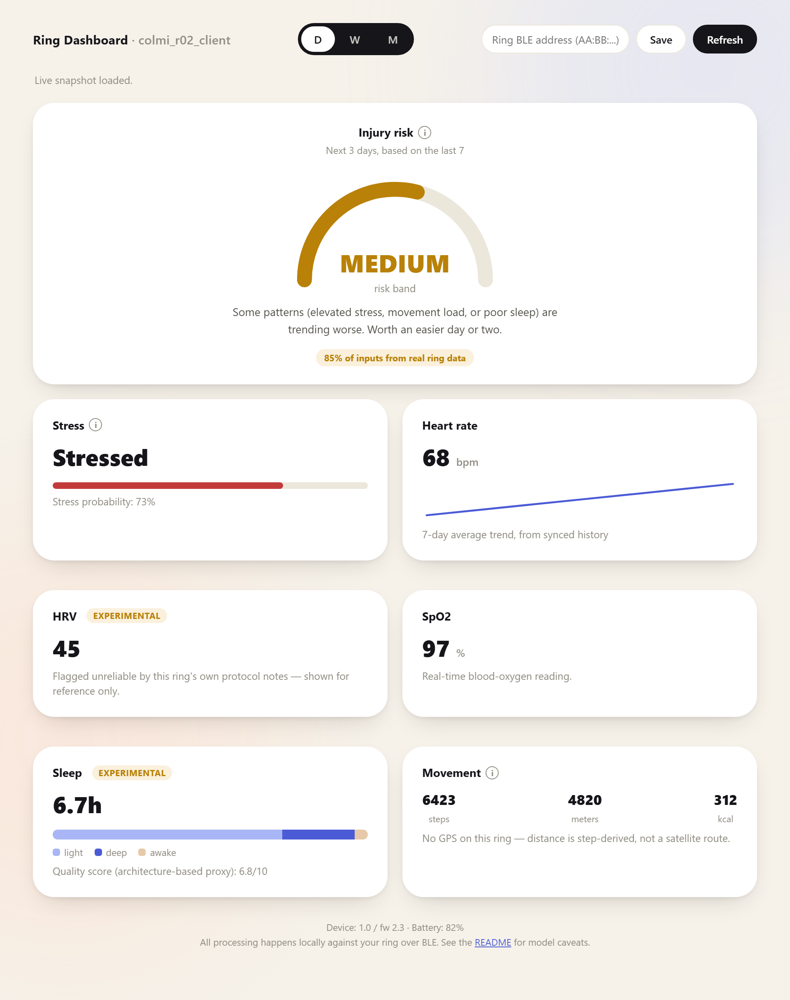

# wearable-prediction

[](https://github.com/tahnok/colmi_r02_client/actions/workflows/ci.yml)
[](LICENSE)
[](pyproject.toml)

## Problem statement

If an athletes get injured, she/he lose the season. Cortisol is the key ormon to spot dangerous stress buildup.

We originally wanted to make a cortisol patch with MIP technology, but while we wait for the reagents we built a cheap version using colorimetry.

IMMAGE

We also modified a wearable to predict injury and stress with ML, whilee building the cortisol database and the ML for hormones.

We start from the Colmi R02 repo and connect **stress** and **injury** prediction, which we previously trained separately, and finally top it all off with a dashboard that shows the data.

You can find detailed info on the stress ML and the injury ML below.

<!-- IMAGE: add architecture / overview image here -->

> **Disclaimer:** Injury prediction is genuinely hard, it's a rare recorded event and a near-unsolved problem in sports science. PR-AUC here is barely above the ~0.6% base rate. This is *not* a bug: the full, non-reduced model in `injury 2/` has the same ceiling (see its README's "Second pass" section). Precision is low bc the data ara umbaance with few recorded case, meaning most "high risk" flags will be false alarms. This is why `colmi_r02_client predict-injury` intentionally only ever reports a coarse **high / medium / low risk over the next 3 days**, not a percentage, see `colmi_r02_client/injury_predict.py`'s docstring for exactly which inputs are real ring data vs. proxies, and treat the output as illustrative, never as medical or coaching advice.

Regenerate these plots with `python "injury 2/scripts/generate_ring_report_plots.py"`.

### Future vision: cortisol & hormones

- **Hormones** are hard because they require night-sleep data, which in the Colmi is still a developing feature.
- **Cortisol** — the dataset is missing, so we're creating it ourselves with cortisol strips.

Roadmap priority:

1. Stress
2. Injury

---

Open source python client to read your data from the Colmi R02 family of Smart Rings, a $20 sensor package (HR, SpO2, accelerometer, sleep) with no official SDK. 100% open source, 100% offline.

- **Accelerometer**
  - step tracking
  - sleep tracking
- **Heart Rate (HR)**
- **Blood Oxygen (SpO2)**

[Source code on GitHub](https://github.com/tahnok/colmi_r02_client)


## Reverse engineering status

- [x] Real time heart rate and SpO2
- [x] Step logs (still don't quite understand how the day is split up)
- [x] Heart rate logs (aka periodic measurement)
- [x] Set ring time
- [x] Set HR log frequency
- [ ] SpO2 logs
- [~] Sleep tracking (implemented in `colmi_r02_client/sleep.py`, but experimental / not yet verified against a real ring, see below)
- [x] "Stress" measurement (ML model on top of heart rate, see below)

## AI features: stress & injury-risk prediction

Two small ML models sit on top of the raw ring data. Both are heart-rate / activity proxies





### Stress prediction

PUT THE OTHER GITHUB

### Injury-risk prediction

`colmi_r02_client predict-injury` estimates injury risk over the next 3 days from the last week of ring history. This is adapted from a separate sports-science project (`injury 2/`, a SoccerMon-based injury prediction pipeline for professional athletes) that normally needs subjective wellness surveys (readiness, soreness, mood, ...) and coach-logged training-load diaries (RPE × session duration, ACWR, ...) — none of which a consumer ring can produce. So the ring integration uses a **separately retrained, reduced model** (`injury 2/model_artifact_ring/`) on only the 4 features a ring can approximate: `stress` (HR-based), `sleep_duration` / `sleep_quality` (from the experimental sleep-sync protocol), and `fatigue` (a movement-volume proxy from steps/calories, standing in for training load).

| Precision-recall curve (pooled out-of-fold) | Confusion matrix (aggregate over folds) |
|---|---|
|  |  |

| Feature importance | Calibration |
|---|---|
|  |  |

## Dashboard

A small local web dashboard (`colmi_r02_client/webapp.py`) puts all of the above in one page: sleep, steps / heart rate / HRV / SpO2, the stress read, and the injury-risk band, styled as rounded cards over synced + live ring data.

IMAGE

```sh
colmi_r02_dashboard --address=70:CB:0D:D0:34:1C --db=ring_data.sqlite
```

Then open <http://127.0.0.1:5050>. `--address` is optional — historical charts work from a database populated by `colmi_r02_client sync` alone; a live snapshot (current HR/SpO2/HRV, today's activity, last night's sleep, stress, and injury risk) needs an address, entered in the page if not passed on the command line. A live snapshot does ~20–30 sequential BLE reads (the injury model alone needs a 14-day movement baseline plus a week of heart-rate logs), so it can take up to a minute — that's normal, not a hang.



Every card that isn't a straightforward sensor reading says so: the injury-risk gauge only ever shows a coarse low/medium/high band (never a raw percentage, see the caveats above), HRV and sleep are marked "experimental", and the movement card is explicit that this ring has no GPS — distance shown is estimated from steps, not a real route.


## Getting started

### Using the command line

If you don't know python that well, I **highly** recommend you install [pipx](https://pipx.pypa.io/stable/installation/). It's purpose built for managing python packages intended to be used as standalone programs, and it will keep your computer safe from the pitfalls of python packaging. Once installed you can do:

```sh
pipx install git+https://github.com/tahnok/colmi_r02_client
```

Once that is done you can look for nearby rings using:

```sh
colmi_r02_util scan
```

```
Found device(s)
                Name  | Address
--------------------------------------------
            R02_341C  |  70:CB:0D:D0:34:1C
```

Once you have your address you can use it to do things like get real time heart rate:

```sh
colmi_r02_client --address=70:CB:0D:D0:34:1C get-real-time heart-rate
```

```
Starting reading, please wait.
[81, 81, 79, 79, 79, 79]
```

You can also sync the data from your ring to sqlite:

```sh
colmi_r02_client --address=3A:08:6A:6F:EB:EC sync
```

```
Writing to /home/wes/src/colmi_r02_client/ring_data.sqlite
Syncing from 2024-12-01 01:43:04.723232+00:00 to 2024-12-01 02:03:20.150315+00:00
Done
```

The database schema is available [here](https://github.com/tahnok/colmi_r02_client/blob/main/tests/database_schema.sql).

The most up to date and comprehensive help for the command line can be found by running:

```sh
colmi_r02_client --help
```

```
Usage: colmi_r02_client [OPTIONS] COMMAND [ARGS]...

Options:
  --debug / --no-debug
  --record / --no-record  Write all received packets to a file
  --address TEXT          Bluetooth address
  --name TEXT             Bluetooth name of the device, slower but will work
                          on macOS
  --help                  Show this message and exit.

Commands:
  get-heart-rate-log           Get heart rate for given date
  get-heart-rate-log-settings  Get heart rate log settings
  get-real-time-heart-rate     Get real time heart rate.
  get-steps                    Get step data
  info                         Get device info and battery level
  raw                          Send the ring a raw command
  reboot                       Reboot the ring
  set-heart-rate-log-settings  Get heart rate log settings
  set-time                     Set the time on the ring, required if you...
  sync                         Sync all data from the ring to a sqlite...
```

### With the library / SDK

You can use the `colmi_r02_client.client` class as a library to do your own stuff in python. I've tried to write a lot of docstrings, which are visible on [the docs site](https://tahnok.github.io/colmi_r02_client/).

## Communication protocol details

I've kept a lab-notebook-style stream-of-consciousness set of notes on <https://notes.tahnok.ca/>, starting with [2024-07-07 Smart Ring Hacking](https://notes.tahnok.ca/blog/2024-07-07+Smart+Ring+Hacking) and eventually getting put under one folder. That's the best source for all the raw stuff.

At a high level, you can talk to and read from the ring using BLE. There's no binding or security keys required to get started. (That's kind of bad, but the range on the ring is really tiny and I'm not too worried about someone getting my steps or heart rate information. Up to you.)

The ring has a BLE GATT service with the UUID `6E40FFF0-B5A3-F393-E0A9-E50E24DCCA9E`. It has two important characteristics:

1. **RX:** `6E400002-B5A3-F393-E0A9-E50E24DCCA9E`, which you write to.
2. **TX:** `6E400003-B5A3-F393-E0A9-E50E24DCCA9E`, which you can "subscribe" to and is where the ring responds to packets you have sent.

This closely resembles the [Nordic UART Service](https://docs.nordicsemi.com/bundle/ncs-latest/page/nrf/libraries/bluetooth_services/services/nus.html) and UART/Serial communications in general.

### Packet structure

The ring communicates in 16-byte packets for both sending and receiving. The first byte of the packet is always a command/tag/type. For example, the packet you send to ask for the battery level starts with `0x03`, and the response packet also starts with `0x03`.

The last byte of the packet is always a checksum/CRC. This value is calculated by summing up the other 15 bytes in the packet and taking the result modulo 255. See `colmi_r02_client.packet.checksum`.

The middle 14 bytes are the "subdata" or payload data. Some requests (like `colmi_r02_client.set_time.set_time_packet`) include additional data. Almost all responses use the subdata to return the data you asked for.

Some requests result in multiple responses that you have to consider together to get the data. `colmi_r02_client.steps.SportDetailParser` is an example of this behaviour.

If you want to know the actual packet structure for a given feature's request or response, take a look at the source code for that feature. I've tried to make it pretty easy to follow even if you don't know python very well. There are also some tests that you can refer to for validated request/response pairs and human-readable interpretations of that data.

Got questions or ideas? [Send me an email](mailto:tahnok+colmir02@gmail.com) or [open an issue](https://github.com/tahnok/colmi_r02_client/issues/new).

# Reference

LINK 
